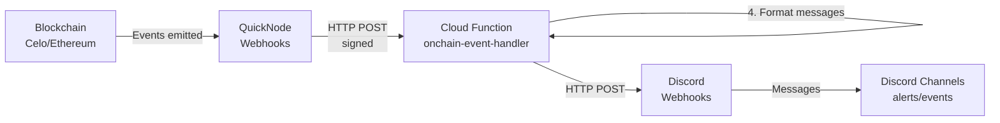

# Mento Alerts

Terraform-managed alert infrastructure for monitoring Mento's infrastructure across multiple blockchain networks.

## 📦 Module Structure

```plain
.
├── main.tf                 # Root configuration and module orchestration
├── variables.tf            # Shared variable definitions
├── outputs.tf              # Aggregated outputs
│
├── sentry-alerts/          # Sentry JS error monitoring
├── onchain-event-listeners/ # QuickNode webhook management for on-chain events
├── onchain-event-handler/   # Cloud Function for processing webhooks
└── discord-channel-manager/ # Discord channels and webhooks
```

## 🏗️ Architecture

### Data Flow



### Component Overview

1. **QuickNode Webhooks**: Monitor blockchain events for configured multisig addresses
2. **Cloud Function**: Processes webhooks, verifies signatures, formats messages
3. **Discord Channels**: Receives formatted alerts and event notifications
4. **Terraform**: Manages all infrastructure as code

### Security

- **Signature Verification**: All QuickNode webhooks are verified using HMAC-SHA256
- **Timestamp Validation**: Prevents replay attacks (5-minute window)
- **Payload Size Limits**: Maximum 10MB payload size
- **Secret Management**: Secrets stored in GCP Secret Manager

## Prerequisites

- **Terraform** >= 1.10.0
- **GCP account** with billing enabled
- **Discord bot** with admin permissions
- **Sentry account** (for JS error monitoring)
- **QuickNode account** (for blockchain monitoring)

## 🚀 Quick Start

### 1. Configure Variables

```bash
cp terraform.tfvars.example terraform.tfvars
```

Edit `terraform.tfvars`:

```hcl
# Discord Configuration
discord_bot_token      = "<your-discord-bot-token>"
discord_server_id      = "<discord-server-id>"
discord_category_id    = "<alert-category-id>"
discord_sentry_role_id = "<sentry-role-id>"
discord_server_name    = "<discord-server-name>"

# Sentry Configuration
sentry_auth_token      = "your-sentry-auth-token"
sentry_organization_slug = "my-org"  # Optional, defaults to "mento-labs"
sentry_team_slug       = "my-team"    # Optional, defaults to "mento-labs"

# GCP Configuration
project_name     = "alerts"              # Optional, defaults to "alerts"
org_id           = "123456789012"        # Optional, omit if not using organization
billing_account  = "XXXXXX-XXXXXX-XXXXXX"  # Required
region           = "europe-west1"        # Optional, defaults to "europe-west1"

# QuickNode Configuration
quicknode_api_key        = "your-quicknode-api-key"
quicknode_signing_secret = "your-signing-secret-at-least-32-chars"  # Generate: openssl rand -hex 32

# Multisig Configuration
multisigs = {
  "mento-labs-celo" = {
    name                   = "Mento Labs Multisig"
    address                = "0x655133d8E90F8190ed5c1F0f3710F602800C0150"
    chain                  = "celo"
    quicknode_network_name = "celo-mainnet"
  }
}

# Optional: Additional Labels
additional_labels = {
  environment = "production"
  team        = "platform"
  cost-center = "infrastructure"
}
```

### 2. Initialize & Deploy

```bash
terraform init
terraform plan
terraform apply
```

**Expected deployment time:** 5-10 minutes

### 3. Verify Deployment

```bash
terraform output
terraform state list
curl -X POST $(terraform output -raw cloud_function_url)  # Should return 401
```

## 📖 Usage Examples

### Single-Chain Setup

```hcl
multisigs = {
  "my-multisig" = {
    name                   = "My Multisig"
    address                = "0x1234567890123456789012345678901234567890"
    chain                  = "celo"
    quicknode_network_name = "celo-mainnet"
  }
}
```

### Multi-Chain Setup

The module automatically groups multisigs by chain and creates one QuickNode webhook per chain. A single Cloud Function handles webhooks from all chains.

```hcl
multisigs = {
  "mento-labs-celo" = {
    name                   = "Mento Labs Multisig"
    address                = "0x655133d8E90F8190ed5c1F0f3710F602800C0150"
    chain                  = "celo"
    quicknode_network_name = "celo-mainnet"
  }
  "mento-labs-ethereum" = {
    name                   = "Mento Labs Multisig"
    address                = "0x1234567890123456789012345678901234567890"
    chain                  = "ethereum"
    quicknode_network_name = "ethereum-mainnet"
  }
}
```

### Supported Chains

- **Celo**: `chain = "celo"`, `quicknode_network_name = "celo-mainnet"`
- **Ethereum**: `chain = "ethereum"`, `quicknode_network_name = "ethereum-mainnet"`

**Note:** `quicknode_network_name` must be a valid QuickNode network identifier. See QuickNode API documentation for the full list of supported networks.

## 📊 What Gets Created

### Sentry Module

- Discord channels: `#sentry-{project-name}` for each Sentry project
- Alert rules forwarding errors to Discord
- Proper permissions for Sentry integration

### Discord Monitoring Infrastructure

**Shared channels for all multisigs:**

- `#🚨︱multisig-alerts` - Critical security events (owner/threshold/module changes)
- `#🔔︱multisig-events` - Normal transaction events (executions, approvals, funds)
- Discord webhooks (automated creation)

### Cloud Function

- Processes QuickNode webhooks from all chains
- Routes security events to alerts channel, operational events to events channel
- Validates webhook signatures
- All multisigs share the same two Discord channels

### QuickNode Webhooks

- One webhook per chain
- Filters events by multisig addresses and event signatures
- Sends filtered events to Cloud Function

## 🔧 Common Operations

### Add New Multisig

Edit `terraform.tfvars`:

```hcl
multisigs = {
  "existing-name" = { ... },
  "new-multisig" = {
    name                   = "New Multisig Name"
    address                = "0xYourAddress..."
    chain                  = "celo"
    quicknode_network_name = "celo-mainnet"
  }
}
```

Then run `terraform apply`.

### View Logs

```bash
cd onchain-event-handler
./scripts/get-logs.sh
```

### Destroy Resources

```bash
terraform destroy -target=module.sentry_alerts  # Specific module
terraform destroy  # Everything
```

## 🐛 Troubleshooting

### Discord Permission Errors

Use the permission checker script:

```bash
cd scripts && npm install
npx tsx scripts/check-discord-permissions.ts
```

**Common errors:**

- `HTTP 403 Forbidden, code 50013` - Missing `MANAGE_CHANNELS` or `MANAGE_WEBHOOKS` permissions
- `HTTP 403 Forbidden, code 50001` - Bot needs proper role permissions

**Quick fix:** Grant bot `Administrator` permission in Discord Server Settings → Roles.

### Invalid Address Format

Addresses must:

- Start with `0x`
- Followed by exactly 40 hexadecimal characters
- Example: `0x655133d8E90F8190ed5c1F0f3710F602800C0150`

### Enable Debug Mode

Add to `terraform.tfvars`:

```hcl
debug_mode = true
```

This shows REST API requests/responses for troubleshooting.

## 📚 Documentation

### Module Documentation

- [`sentry-alerts/README.md`](sentry-alerts/README.md) - Sentry module details
- [`discord-channel-manager/README.md`](discord-channel-manager/README.md) - Discord infrastructure module
- [`onchain-event-listeners/README.md`](onchain-event-listeners/README.md) - QuickNode webhook module for on-chain events
- [`onchain-event-handler/README.md`](onchain-event-handler/README.md) - Cloud Function module

### Code Quality

Follows [AWS Terraform best practices](https://docs.aws.amazon.com/prescriptive-guidance/latest/terraform-aws-provider-best-practices/structure.html) (adapted for GCP):

- Standard structure with data sources in dedicated `data.tf` files
- Consistent formatting (output descriptions, variable descriptions, naming conventions)
- Comprehensive labeling pattern using `merge()` for extensibility (GCP equivalent of AWS tags)
- Comprehensive README files for all modules with inline usage examples

### External Documentation

- [Terraform Documentation](https://developer.hashicorp.com/terraform/docs)
- [Sentry API Docs](https://docs.sentry.io/api/)
- [Discord Developer Docs](https://discord.com/developers/docs)
- [QuickNode Documentation](https://www.quicknode.com/docs)

## 🔒 Security

- API keys stored in `terraform.tfvars` (gitignored)
- Sensitive outputs marked appropriately
- State file contains secrets - handle carefully
- Webhook signatures validated for QuickNode requests

## 💰 Cost Estimate

~$5-20/month per chain (Cloud Function + Storage)

---

**Quick Commands Reference:**

```bash
# Initialization
terraform init
terraform plan
terraform apply

# Management
terraform output
terraform state list

# Updates
terraform plan
terraform apply

# Destruction
terraform destroy
```
